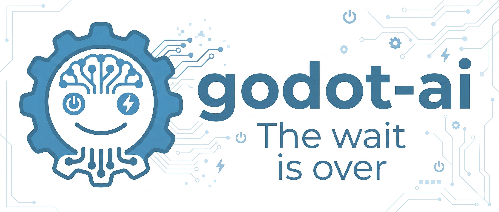
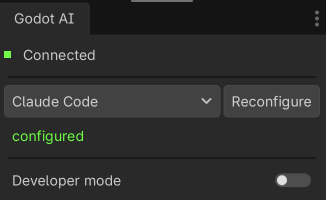
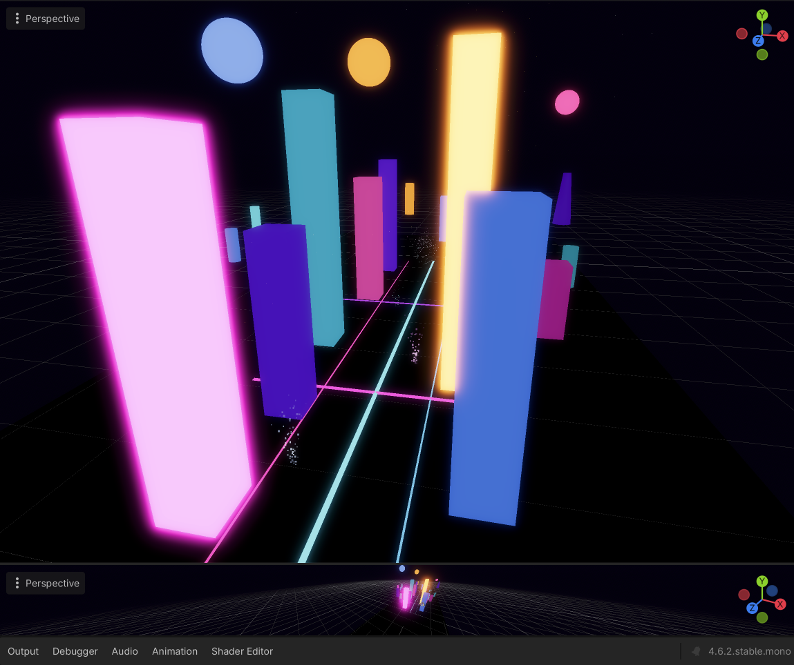

<p align="center">
  
</p>

# Godot AI

[](https://github.com/hi-godot/godot-ai/actions/workflows/ci.yml)
[](https://codecov.io/gh/hi-godot/godot-ai)

**Connect MCP clients directly to a live Godot editor.** Godot AI bridges AI assistants (Claude Code, Codex, Antigravity, etc.) with your Godot Editor via the [Model Context Protocol](https://modelcontextprotocol.io/introduction). Inspect scenes, create nodes, search project data, run tests, and read structured editor resources — all from a prompt.

> **Status:** early, usable, and still expanding.

*Independent community project, not affiliated with the [Godot Foundation](https://godot.foundation). Godot Engine is [MIT-licensed](https://godotengine.org/license).*

---

## Quick Start

### Prerequisites

- Godot `4.3+` (`4.4+` recommended)
- [uv](https://docs.astral.sh/uv/) (used to install the Python server)
- An MCP client ([Claude Code](https://docs.anthropic.com/en/docs/claude-code) | [Codex](https://openai.com/index/codex/) | [Antigravity](https://www.antigravity.dev/))

### 1. Install the plugin

Clone the repo (or [download the zip](https://github.com/hi-godot/godot-ai/archive/refs/heads/main.zip)) and copy the plugin into your Godot project:

```bash
git clone https://github.com/hi-godot/godot-ai.git
cp -r godot-ai/plugin/addons/godot_ai your-project/addons/
```

### 2. Enable the plugin

In Godot: **Project > Project Settings > Plugins** — enable **Godot AI**.

The plugin will automatically start the MCP server, connect over WebSocket, and show status in the **Godot AI** dock.

<p align="center"></p>

### 3. Connect your MCP client

The dock lists every supported client in a scrollable grid with a status dot
and per-row **Configure** / **Remove** buttons. Press **Configure all** to set
up every client at once. Auto-configure handles:

- **Claude Code** — CLI (`claude mcp add`)
- **Claude Desktop** — JSON config + `npx mcp-remote` stdio bridge
- **Codex** — TOML (`~/.codex/config.toml`)
- **Antigravity** — JSON config
- **Cursor** — `~/.cursor/mcp.json`
- **Windsurf** — `~/.codeium/windsurf/mcp_config.json`
- **VS Code** & **VS Code Insiders** — `<user>/Code/User/mcp.json`
- **Zed** — `~/.config/zed/settings.json` (via `npx mcp-remote`)
- **Gemini CLI** — `~/.gemini/settings.json`
- **Cline**, **Kilo Code**, **Roo Code** — VS Code extension globalStorage
- **Kiro** — `~/.kiro/settings/mcp.json`
- **Trae** — `<user>/Trae/User/mcp.json`
- **Cherry Studio** — `<user>/CherryStudio/mcp_servers.json`
- **OpenCode** — `~/.config/opencode/opencode.json`
- **Qwen Code** — `~/.qwen/settings.json`

If auto-configure can't find a CLI (GUI-launched editors have a limited PATH),
each row exposes a **Run this manually** panel with a copyable snippet. Server
URL is always `http://127.0.0.1:8000/mcp`.

> Adding a new client: drop a `clients/<name>.gd` descriptor under
> `plugin/addons/godot_ai/clients/` and add one `preload(...)` line to
> `clients/_registry.gd`. No edits to dock or facade required.

### 4. Try it

- *"Show me the current scene hierarchy."*
- *"Create a Camera3D named MainCamera under /Main."*
- *"Search the project for PackedScene files in ui/."*
- *"Run the scene test suite."*
- *"Build a neon space city with glass towers, glowing planets, and fire / magic / spark particle effects."*

<p align="center">
  <a href="docs/images/space-city.png"></a>
</p>
<p align="center"><em>An AI-authored scene: 10 emissive buildings, 3 glowing planets, Tron-style floor strips, and 6 varied particle effects — every node, material, and preset placed by MCP tool calls.</em></p>

---

<details>
<summary><strong>Available Tools</strong></summary>

### Sessions and Editor

| Tool | Description |
|------|-------------|
| `session_list` | List connected Godot editor sessions |
| `session_activate` | Set the active session for multi-editor routing |
| `editor_state` | Read Godot version, project name, current scene, and play state |
| `editor_selection_get` | Read the current editor selection |
| `logs_read` | Read recent MCP log lines from the editor |
| `editor_reload_plugin` | Reload the Godot editor plugin and wait for reconnect |

### Scene and Nodes

| Tool | Description |
|------|-------------|
| `scene_get_hierarchy` | Read the scene tree with pagination |
| `scene_get_roots` | List open scenes in the editor |
| `node_create` | Create a node by type with optional name and parent path |
| `node_find` | Search nodes by name, type, or group |
| `node_get_properties` | Read all properties for a node |
| `node_get_children` | Read direct children for a node |
| `node_get_groups` | Read group membership for a node |

### Project and Testing

| Tool | Description |
|------|-------------|
| `project_settings_get` | Read a Godot project setting by key |
| `filesystem_search` | Search project files by name, type, or path |
| `test_run` | Run GDScript test suites inside the editor |
| `test_results_get` | Read the most recent test results without rerunning |

### Client Setup

| Tool | Description |
|------|-------------|
| `client_configure` | Configure a supported MCP client from the editor |
| `client_status` | Check which supported clients are configured |

</details>

<details>
<summary><strong>MCP Resources</strong></summary>

| Resource URI | Description |
|-------------|-------------|
| `godot://sessions` | Connected editor sessions with metadata |
| `godot://scene/current` | Current scene path, project name, and play state |
| `godot://scene/hierarchy` | Full scene hierarchy from the active editor |
| `godot://selection/current` | Current editor selection |
| `godot://project/info` | Active project metadata |
| `godot://project/settings` | Common project settings subset |
| `godot://logs/recent` | Recent editor log lines |

</details>

<details>
<summary><strong>Manual Client Configuration</strong></summary>

**Claude Code**

```bash
claude mcp add --scope user --transport http godot-ai http://127.0.0.1:8000/mcp
```

**Codex** (`~/.codex/config.toml`)

```toml
[mcp_servers."godot-ai"]
url = "http://127.0.0.1:8000/mcp"
enabled = true
```

**Antigravity** (`~/.gemini/antigravity/mcp_config.json`)

```json
{
  "mcpServers": {
    "godot-ai": {
      "serverUrl": "http://127.0.0.1:8000/mcp",
      "disabled": false
    }
  }
}
```

</details>

<details>
<summary><strong>How It Works</strong></summary>

```text
MCP Client
   | HTTP (/mcp)
   v
Python Server (FastMCP)      port 8000
   | WebSocket               port 9500
   v
Godot Editor Plugin
   | EditorInterface + SceneTree APIs
   v
Godot Editor
```

The plugin starts or reuses the Python server, connects over WebSocket, and exposes editor capabilities as MCP tools and resources over HTTP.

</details>

<details>
<summary><strong>Contributing</strong></summary>

See [CONTRIBUTING.md](docs/CONTRIBUTING.md) for development setup, testing, and PR guidelines.

</details>

---

**License:** [MIT](LICENSE) | **Issues:** [GitHub](https://github.com/hi-godot/godot-ai/issues)
