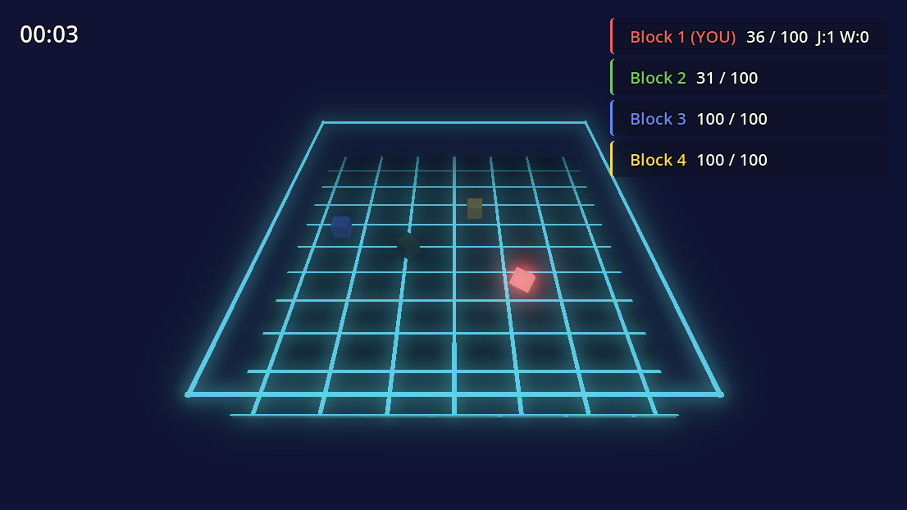

<p align="center">
  
</p>

# Godot AI

[](https://github.com/hi-godot/godot-ai/actions/workflows/ci.yml)
[](https://codecov.io/gh/hi-godot/godot-ai)

**Connect MCP clients directly to a live Godot editor.** Godot AI bridges AI assistants (Claude Code, Codex, Antigravity, etc.) with your Godot Editor via the [Model Context Protocol](https://modelcontextprotocol.io/introduction).

Over **120 MCP tools** expose the editor's real authoring surface: build and edit scenes, create and reparent nodes, set properties, attach and patch GDScript, wire signals, create resources and materials, author animations on an `AnimationPlayer`, configure particles, cameras, and environments, build Control / theme layouts, manage project settings, autoloads, and the input map, search and read project files, capture screenshots, and run GDScript test suites — all from a prompt, every write undoable in the editor.

> 🎉 **Now on the [Godot Asset Library](https://godotengine.org/asset-library/asset/5050)** — one-click install from Godot's **AssetLib** tab. You'll still need [uv](https://docs.astral.sh/uv/) on your system for the Python server (see [Quick Start](#quick-start)).

<p align="center"></p>

*Independent community project, not affiliated with the [Godot Foundation](https://godot.foundation). Godot Engine is [MIT-licensed](https://godotengine.org/license).*

---

## Quick Start

### Prerequisites

- Godot `4.3+` (`4.4+` recommended)
- [uv](https://docs.astral.sh/uv/) (used to install the Python server)
- An MCP client ([Claude Code](https://docs.anthropic.com/en/docs/claude-code) | [Codex](https://openai.com/index/codex/) | [Antigravity](https://www.antigravity.dev/))

### 1. Install the plugin

**Recommended — via the [Godot Asset Library](https://godotengine.org/asset-library/asset/5050):** in Godot, open the **AssetLib** tab, search for **Godot AI**, click **Download**, then **Install**.

<details>
<summary>Or install from source</summary>

```bash
git clone https://github.com/hi-godot/godot-ai.git
cp -r godot-ai/plugin/addons/godot_ai your-project/addons/
```

Alternatively, [download the latest release ZIP](https://github.com/hi-godot/godot-ai/releases/latest) and extract `addons/godot_ai` into your project's `addons/` folder.

</details>

### 2. Enable the plugin

In Godot: **Project > Project Settings > Plugins** — enable **Godot AI**.

The plugin will automatically start the MCP server, connect over WebSocket, and show status in the **Godot AI** dock.

<p align="center"></p>

### 3. Connect your MCP client

The dock lists every supported client with a status dot and per-row
**Configure** / **Remove** buttons, or press **Configure all**. Auto-configure
covers:

- **Claude Code**, **Claude Desktop**, **Antigravity**

<details>
<summary><strong>…and 15+ more clients</strong></summary>

Codex, Cursor, Windsurf, VS Code, VS Code Insiders, Zed, Gemini CLI, Cline,
Kilo Code, Roo Code, Kiro, Trae, Cherry Studio, OpenCode, Qwen Code.

</details>

Server URL is always `http://127.0.0.1:8000/mcp`. If auto-configure can't find
a CLI, each dock row exposes a **Run this manually** panel with a copyable
snippet.

### 4. Try it

- *"Show me the current scene hierarchy."*
- *"Create a Camera3D named MainCamera under /Main."*
- *"Search the project for PackedScene files in ui/."*
- *"Run the scene test suite."*
- *"Build a voxel block-world game with a player, blocks to place and destroy, and save slots."*

<p align="center">
  <a href="docs/images/blockgame.png"></a>
</p>
<p align="center"><em>An AI-authored scene built from a handful of prompts — terrain, player, blocks, and UI, all placed by MCP tool calls. The full game and modular save system built by Godot AI are <a href="https://github.com/dsarno/save-system-godot-claude">available free here</a>.</em></p>

---

<details>
<summary><strong>Available Tools</strong></summary>

### Sessions and Editor

| Tool | Description |
|------|-------------|
| `session_list` | List connected Godot editor sessions |
| `session_activate` | Set the active session for multi-editor routing |
| `editor_state` | Read Godot version, project name, current scene, and play state |
| `editor_selection_get` / `editor_selection_set` | Read or set the editor selection |
| `editor_screenshot` | Capture the editor viewport or a sub-viewport |
| `editor_reload_plugin` / `editor_quit` | Reload the plugin or quit the editor |
| `logs_read` / `logs_clear` | Read or clear recent MCP log lines |
| `performance_monitors_get` | Read Godot performance monitors (FPS, memory, draw calls, etc.) |
| `batch_execute` | Run multiple plugin commands in one round trip |

### Scene and Nodes

| Tool | Description |
|------|-------------|
| `scene_create` / `scene_open` / `scene_save` / `scene_save_as` | Create, open, and save scenes |
| `scene_get_hierarchy` / `scene_get_roots` | Read the scene tree or list open scenes |
| `node_create` / `node_delete` / `node_duplicate` | Create, delete, or duplicate nodes |
| `node_rename` / `node_reparent` / `node_move` | Rename, reparent, or reorder nodes |
| `node_find` | Search nodes by name, type, or group |
| `node_get_properties` / `node_set_property` | Read or write node properties |
| `node_get_children` | Read direct children for a node |
| `node_add_to_group` / `node_remove_from_group` / `node_get_groups` | Manage group membership |

### Scripts and Signals

| Tool | Description |
|------|-------------|
| `script_create` / `script_read` / `script_patch` | Create, read, or patch GDScript files |
| `script_attach` / `script_detach` | Attach or detach scripts from nodes |
| `script_find_symbols` | Find class, function, or signal symbols in project scripts |
| `signal_list` / `signal_connect` / `signal_disconnect` | Inspect and wire up signals |

### Resources, Materials, Textures

| Tool | Description |
|------|-------------|
| `resource_create` / `resource_load` / `resource_assign` / `resource_get_info` / `resource_search` | Create, load, assign, and search `.tres` / `.res` resources |
| `material_create` / `material_list` / `material_get` | Create and inspect materials |
| `material_assign` / `material_apply_to_node` / `material_apply_preset` | Assign materials and apply named presets |
| `material_set_param` / `material_set_shader_param` | Set material or shader parameters |
| `gradient_texture_create` / `noise_texture_create` | Generate gradient or noise textures |
| `curve_set_points` | Set points on a `Curve` resource |

### UI, Controls, Theme

| Tool | Description |
|------|-------------|
| `ui_build_layout` | Build a Control layout tree from a recipe |
| `ui_set_text` / `ui_set_anchor_preset` | Set Control text or anchor preset |
| `control_draw_recipe` | Attach a procedural draw recipe script to a Control |
| `theme_create` / `theme_apply` | Create themes and apply them to Controls |
| `theme_set_color` / `theme_set_constant` / `theme_set_font_size` / `theme_set_stylebox_flat` | Edit theme entries |

### Animation

| Tool | Description |
|------|-------------|
| `animation_player_create` | Create an `AnimationPlayer` node |
| `animation_create` / `animation_create_simple` / `animation_delete` | Create or delete animations |
| `animation_list` / `animation_get` / `animation_validate` | Inspect and validate animations |
| `animation_add_property_track` / `animation_add_method_track` | Add property or method tracks |
| `animation_play` / `animation_stop` / `animation_set_autoplay` | Playback controls |
| `animation_preset_fade` / `animation_preset_pulse` / `animation_preset_shake` / `animation_preset_slide` | Named animation presets |

### Audio

| Tool | Description |
|------|-------------|
| `audio_player_create` / `audio_list` | Create and list audio players |
| `audio_play` / `audio_stop` | Control playback |
| `audio_player_set_stream` / `audio_player_set_playback` | Assign streams and tune playback |

### Particles, Environment, Camera

| Tool | Description |
|------|-------------|
| `particle_create` / `particle_get` / `particle_restart` | Create, inspect, restart particle systems |
| `particle_set_main` / `particle_set_process` / `particle_set_draw_pass` / `particle_apply_preset` | Configure particle nodes |
| `environment_create` | Create a `WorldEnvironment` with a configured `Environment` |
| `camera_create` / `camera_list` / `camera_get` | Create and inspect cameras |
| `camera_configure` / `camera_apply_preset` | Tune camera settings or apply presets |
| `camera_follow_2d` / `camera_set_limits_2d` / `camera_set_damping_2d` | 2D camera helpers |
| `physics_shape_autofit` | Auto-fit a collision shape to a mesh |

### Project, Filesystem, Input

| Tool | Description |
|------|-------------|
| `project_settings_get` / `project_settings_set` | Read or write Godot project settings |
| `project_run` / `project_stop` | Run or stop the project from the editor |
| `autoload_add` / `autoload_remove` / `autoload_list` | Manage autoload singletons |
| `filesystem_search` / `filesystem_read_text` / `filesystem_write_text` / `filesystem_reimport` | Search, read, write, and reimport project files |
| `input_map_add_action` / `input_map_remove_action` / `input_map_bind_event` / `input_map_list` | Manage the project input map |

### Testing and Client Setup

| Tool | Description |
|------|-------------|
| `test_run` | Run GDScript test suites inside the editor |
| `test_results_get` | Read the most recent test results without rerunning |
| `client_configure` / `client_remove` / `client_status` | Configure, remove, or check supported MCP clients |

</details>

<details>
<summary><strong>MCP Resources</strong></summary>

| Resource URI | Description |
|-------------|-------------|
| `godot://sessions` | Connected editor sessions with metadata |
| `godot://scene/current` | Current scene path, project name, and play state |
| `godot://scene/hierarchy` | Full scene hierarchy from the active editor |
| `godot://selection/current` | Current editor selection |
| `godot://project/info` | Active project metadata |
| `godot://project/settings` | Common project settings subset |
| `godot://logs/recent` | Recent editor log lines |

</details>

<details>
<summary><strong>Manual Client Configuration</strong></summary>

**Claude Code**

```bash
claude mcp add --scope user --transport http godot-ai http://127.0.0.1:8000/mcp
```

**Codex** (`~/.codex/config.toml`)

```toml
[mcp_servers."godot-ai"]
url = "http://127.0.0.1:8000/mcp"
enabled = true
```

**Antigravity** (`~/.gemini/antigravity/mcp_config.json`)

```json
{
  "mcpServers": {
    "godot-ai": {
      "serverUrl": "http://127.0.0.1:8000/mcp",
      "disabled": false
    }
  }
}
```

</details>

<details>
<summary><strong>How It Works</strong></summary>

```text
MCP Client
   | HTTP (/mcp)
   v
Python Server (FastMCP)      port 8000
   | WebSocket               port 9500
   v
Godot Editor Plugin
   | EditorInterface + SceneTree APIs
   v
Godot Editor
```

The plugin starts or reuses the Python server, connects over WebSocket, and exposes editor capabilities as MCP tools and resources over HTTP.

</details>

<details>
<summary><strong>Contributing</strong></summary>

See [CONTRIBUTING.md](docs/CONTRIBUTING.md) for development setup, testing, and PR guidelines.

</details>

---

**License:** [MIT](LICENSE) | **Issues:** [GitHub](https://github.com/hi-godot/godot-ai/issues)
