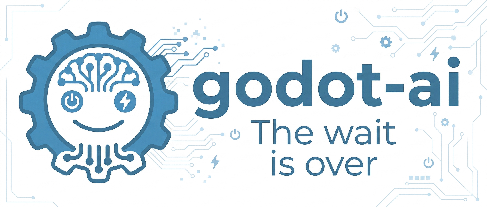
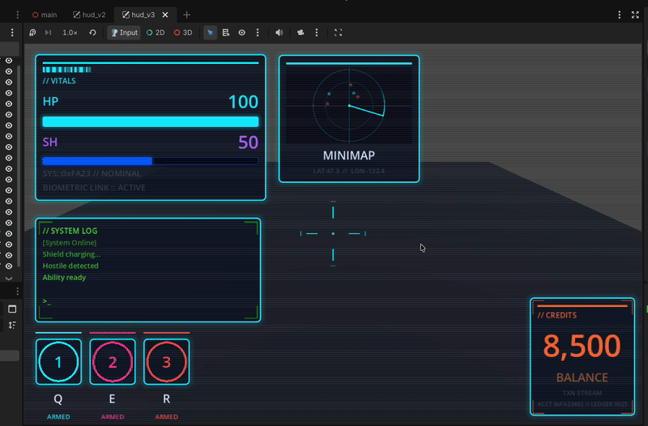
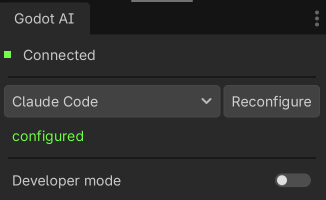
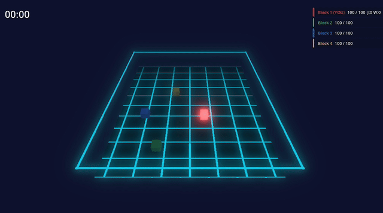

<p align="center">
  
</p>

# Godot AI

[](https://github.com/hi-godot/godot-ai/actions/workflows/ci.yml)
[](https://codecov.io/gh/hi-godot/godot-ai)
[](https://store.godotengine.org/asset/dlight/godot-ai/)
[](https://discord.gg/FDZ5fr2QkP)

**Godot AI connects Claude Code, Claude Desktop, Codex, Hermes Agent, and other
[MCP](https://modelcontextprotocol.io/introduction) clients to a live Godot
editor.** Its [~43 tools and 120+ operations](docs/TOOLS.md) let AI assistants
build scenes, edit nodes and scripts, wire signals, and configure UI, materials,
animation, particles, cameras, and environments.

> 📦 Install from the [Godot Asset Store](https://store.godotengine.org/asset/dlight/godot-ai/) or the legacy [Asset Library](https://godotengine.org/asset-library/asset/5050). The Python server requires [uv](https://docs.astral.sh/uv/).

> 💬 **[Join the Discord](https://discord.gg/FDZ5fr2QkP)** — questions, showcases, and contributor chat.

---

<p align="center">
  <br>
  <em>UI demo built in ~2 hours with zero coding, zero image gen, all programmatically drawn by Godot AI — <a href="https://github.com/hi-godot/cyberpunk-hud-demo">source</a></em>
</p>

---

## Quick Start

### Prerequisites

- Godot `4.5+` (`4.7+` recommended)
- [uv](https://docs.astral.sh/uv/) (for the Python server)

  <details>
  <summary>How to install uv (macOS / Linux / Windows / package managers)</summary>

  - **macOS / Linux:** `curl -LsSf https://astral.sh/uv/install.sh | sh`
  - **Windows (PowerShell):** `powershell -ExecutionPolicy ByPass -c "irm https://astral.sh/uv/install.ps1 | iex"`
  - **Package managers:** `brew install uv`, `sudo pacman -S uv`,
    `sudo apt install uv`, or `sudo dnf install uv`
  - More options: [uv installation guide](https://docs.astral.sh/uv/getting-started/installation/)

  </details>
- An MCP client ([Claude Code](https://docs.anthropic.com/en/docs/claude-code) | [Codex](https://openai.com/index/codex/) | [Antigravity](https://www.antigravity.dev/))

### 1. Install the plugin

**From source** (latest):

```bash
git clone https://github.com/hi-godot/godot-ai.git
cp -r godot-ai/plugin/addons/godot_ai your-project/addons/
```

Or [download the latest release ZIP](https://github.com/hi-godot/godot-ai/releases/latest)
and extract `addons/godot_ai` into your project's `addons/` folder.

<details>
<summary>Or from a Godot marketplace</summary>

Use the [Godot Asset Store](https://store.godotengine.org/asset/dlight/godot-ai/)
or the deprecated but still-active [Asset Library](https://godotengine.org/asset-library/asset/5050).
Marketplace releases may lag behind GitHub.

</details>

### 2. Enable the plugin

In Godot: **Project > Project Settings > Plugins** — enable **Godot AI**.

The plugin will automatically start the MCP server, connect over WebSocket, and show status in the **Godot AI** dock.

<p align="center"></p>

### 3. Connect your MCP client

The dock shows every supported client with **Configure** / **Remove** controls;
use **Configure all** to set up every detected client. Supported clients include:

- **Claude Code**, **Claude Desktop**, **Antigravity**, **Hermes Agent**, **DeepSeek Harness**

<details>
<summary><strong>…and 17+ more clients</strong></summary>

Codex, **Grok Build**, Cursor, Devin Desktop, VS Code, VS Code Insiders, Zed,
Gemini CLI, Cline, Kilo Code, Roo Code, Zoo Code, Kiro, Trae, Cherry Studio,
OpenCode, Qwen Code, Kimi Code, and Pi Agent.

</details>

> **Pi Coding Agent:** Install an MCP extension that reads
> `~/.pi/agent/mcp.json`; Pi has no built-in MCP support. See the
> [Pi package gallery](https://pi.dev/packages).

Most clients use `godot-ai attach`, a client-owned stdio bridge that starts or
reuses the local backend, making tools available before Godot opens and across
same-version editor restarts. The dock shows the configured transport and, when
needed, a copyable manual command. Cherry Studio remains URL-only because it
manages MCP servers inside the app.

<details>
<summary><strong>Registering per-project instead of globally</strong></summary>

CLI-configured clients use global `user` scope by default. To limit Godot AI to
one project, set **Editor Settings → Plugins → `godot_ai/mcp_client_scope`** to
`project` (or `local`, where supported), then press **Configure** again.

> [!IMPORTANT]
> **Configure** removes existing `godot-ai` entries from every scope before
> writing the selected one. This can modify a checked-in `.mcp.json`, but never
> touches other server entries. **Remove** only affects the currently selected
> scope.

For `project` scope:

- The client CLI resolves the project config against **its own working
  directory**. Launch Godot from the project directory so `.mcp.json` lands
  where expected.
- Claude Code requires one-time approval: run `claude` in the project and
  accept the prompt.

Re-run **Configure** after changing ports, excluded domains, or plugin versions.

</details>

### 4. Try it

- *"Show me the current scene hierarchy."*
- *"Create a Camera3D named MainCamera under /Main."*
- *"Search the project for PackedScene files in ui/."*
- *"Run the scene test suite."*
- *"Build a voxel block-world game with a player, blocks to place and destroy, and save slots."*

<p align="center">
  
</p>
<p align="center"><em>Demo gamelet with sophisticated save system built from a handful of Godot AI MCP prompts. Code and Godot project  <a href="https://github.com/dsarno/save-system-godot-claude">available free here</a>.</em></p>

---

**Tools and resources:** see [docs/TOOLS.md](docs/TOOLS.md) for the full tool, op, and resource list (~43 tools exposing 120+ ops, plus read-only `godot://` resources), grouped by domain.

**Testing:** the plugin ships an in-editor GDScript test framework — your AI client (or you) can write `McpTestSuite` suites for your own game under `res://tests/` and run them with `test_run`. See [docs/testing.md](docs/testing.md).

<details>
<summary><strong>Manual Client Configuration</strong></summary>

Prefer the dock-generated command: it selects a compatible launcher and includes
the current version, ports, and excluded tool domains. Re-run **Configure**
after any of those values change.

**Claude Code:**

```bash
claude mcp add --scope user --transport http godot-ai http://127.0.0.1:8000/mcp
```

**Claude Desktop** (`claude_desktop_config.json`):

```json
{
  "mcpServers": {
    "godot-ai": {
      "command": "/absolute/path/to/uvx",
      "args": ["--link-mode", "copy", "--from", "godot-ai==VERSION", "godot-ai", "attach", "--port", "8000", "--ws-port", "9500"]
    }
  }
}
```

**Codex** (`~/.codex/config.toml`):

```toml
[mcp_servers."godot-ai"]
command = "godot-ai"
args = [
  "attach",
  "--port", "8000",
  "--ws-port", "9500",
]
enabled = true
startup_timeout_sec = 60
tool_timeout_sec = 360
```

On Windows, use the dock-generated entry so Store/MSIX paths and consoleless
launching are handled correctly. Other clients expose their exact config in
the dock's **Run this manually** panel.

Clients that support URL transport can instead use:

```toml
[mcp_servers."godot-ai"]
url = "http://127.0.0.1:8000/mcp"
enabled = true
```

URL mode relies on the client's reconnect behavior and may require a client
restart if Godot AI was not running at startup.

</details>

<details>
<summary><strong>How It Works</strong></summary>

```text
MCP Client
   | HTTP (/mcp)
   v
Python Server (FastMCP)      port 8000
   | WebSocket               port 9500
   v
Godot Editor Plugin
   | EditorInterface + SceneTree APIs
   v
Godot Editor
```

The plugin connects the editor to the Python MCP server over WebSocket; clients
reach its tools and resources over HTTP or the `attach` stdio bridge.

</details>

<details>
<summary><strong>Remote / LAN access (<code>--allow-host</code>)</strong></summary>

The server binds to `127.0.0.1` by default. For LAN access, pass trusted IPs or
CIDRs with `--allow-host` (repeat or comma-separate the flag):

```bash
godot-ai --allow-host 192.168.1.0/24
```

The editor WebSocket remains loopback-only. Allow only trusted ranges; prefer
an SSH tunnel or Tailscale on untrusted networks.

</details>

<details>
<summary><strong>Legacy <code>mcp-proxy</code> import errors</strong></summary>

Update Godot AI, press **Configure** again, and restart the MCP client. This
replaces old `mcp-proxy` entries with the current `godot-ai attach` launcher.

</details>

<details>
<summary><strong>Windows: <code>uvx</code> or <code>pywin32</code> install errors</strong></summary>

Close Godot and the MCP client, reopen Godot, press **Configure**, then restart
the client. Configure uses `--link-mode copy`, and the plugin cleans stale uv
build directories to avoid Windows file-lock races. If the error persists,
stop stray Godot AI Python processes before retrying.

</details>

<details>
<summary><strong>Contributing</strong></summary>

See [CONTRIBUTING.md](docs/CONTRIBUTING.md) for development setup, testing, and
PR guidelines. AI assistants should also read [AGENTS.md](AGENTS.md).

**Windows:** run `.\script\setup-dev.ps1` in PowerShell; it creates the test
project junction without admin rights or Developer Mode.

</details>

<details>
<summary><strong>Telemetry &amp; Privacy</strong></summary>

Anonymous telemetry includes an installation UUID, event name, outcome,
duration, platform, and version. It excludes code, scene contents, project/file
names, and personal data; project-directory slugs are SHA-256 hashed.

Opt out by setting either environment variable to `true`:

```bash
export GODOT_AI_DISABLE_TELEMETRY=true
# or
export DISABLE_TELEMETRY=true
```

Opt-out creates no UUID, worker, or files. See [telemetry and privacy details](docs/TELEMETRY.md).

</details>

---

## Star History

<!-- Regenerated daily by .github/workflows/star-history.yml (#750):
     GitHub restricted stargazer history to repo collaborators, which broke
     star-history.com's unauthenticated embed, so the chart is rendered in CI
     and published to the dedicated `star-history` branch (do not delete it —
     embedded below; a manual workflow run recreates it if needed). -->
<a href="https://github.com/hi-godot/godot-ai/stargazers">
  
</a>

---

**License:** [MIT](LICENSE) | **Issues:** [GitHub](https://github.com/hi-godot/godot-ai/issues)
