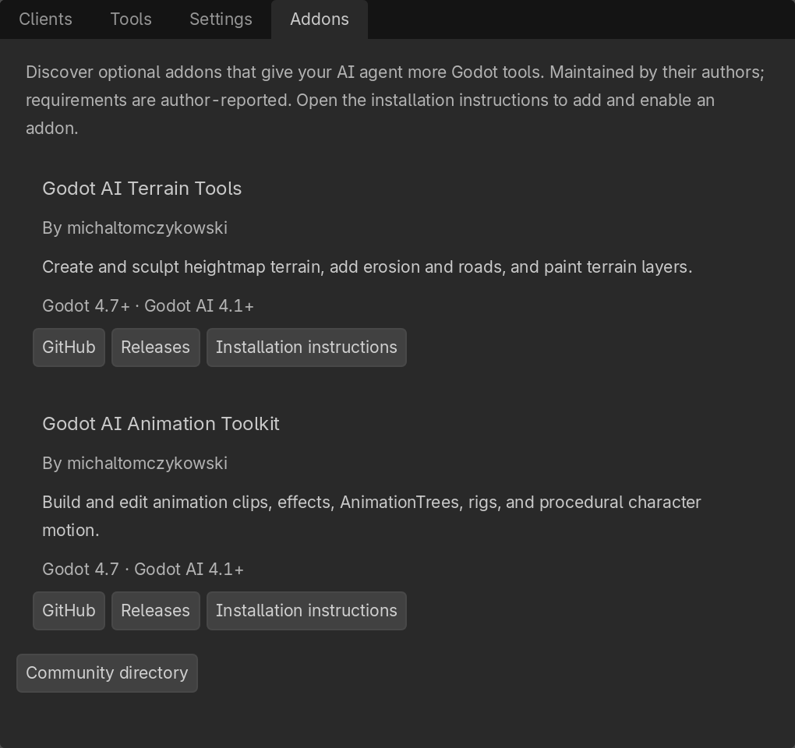
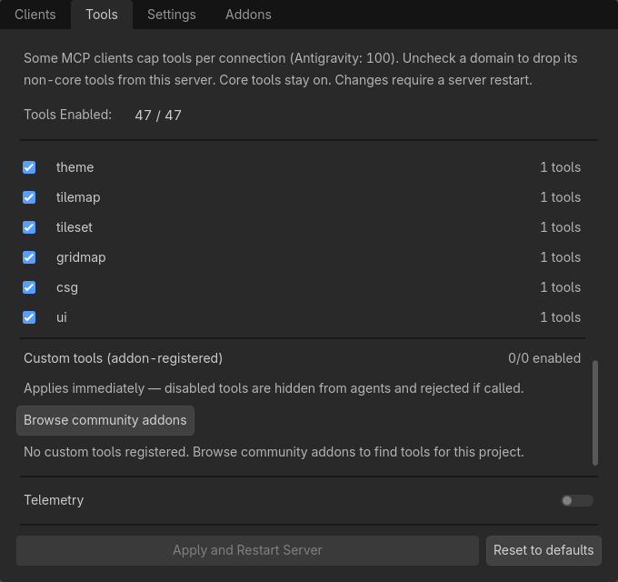

# Community addons

Optional addons extend Godot AI with tools for specific workflows. Install them
alongside Godot AI and follow each project's setup instructions. These addons
are maintained by their authors; compatibility below is reported by the addon.

Open **Clients & Tools > Addons** in the Godot AI dock to browse the bundled
directory. Each entry links to its GitHub repository, releases, and installation
instructions. The list is available offline; the links open in your browser.
Follow the author's instructions to install and enable an addon, then use the
**Tools** tab to manage its registered tools.

The **Tools** tab also has a **Browse community addons** shortcut, including
when no custom tools have been registered yet.

| Addon | What it adds | Requirements |
| --- | --- | --- |
| [Godot AI Terrain Tools](https://github.com/michaltomczykowski/godot-ai-terrain-tools) | Editor tools for heightmap terrain creation, sculpting, erosion, roads, and painting. | Godot 4.7+, Godot AI 4.1+. |
| [Godot AI Animation Toolkit](https://github.com/michaltomczykowski/godot-ai-animation-toolkit) | Animation clip creation and editing, effects, AnimationTrees, rigs, and procedural character motion. | Godot 4.7, Godot AI 4.1+. |

Requirements above apply to using each addon with Godot AI. The Animation
Toolkit reports standalone support for Godot 4.5–4.7; Godot AI itself requires
Godot 4.7 or newer.

Use `custom_manage` with `op="list"` to discover enabled custom tools in your
project. An addon may also expose selected operations as named `custom_*` tools.

## Publish an addon

See the [custom-tool authoring guide](plugin-architecture.md#custom-tools-third-party-addons).
The terrain addon's [registration code](https://github.com/michaltomczykowski/godot-ai-terrain-tools/blob/main/addons/godot_ai_terrain_tools/plugin.gd)
is an example of registering tools and handling Godot AI reloads.

To add your published addon to this directory, submit a PR with its repository
link, a short description, supported Godot and Godot AI versions, and installation
instructions in the addon's README. Keep entries focused on available addons;
proposals can be listed once there is something users can install.
Update the bundled list in `plugin/addons/godot_ai/dock_panels/addons_panel.gd`
alongside this directory so users can discover the addon in the editor too.
